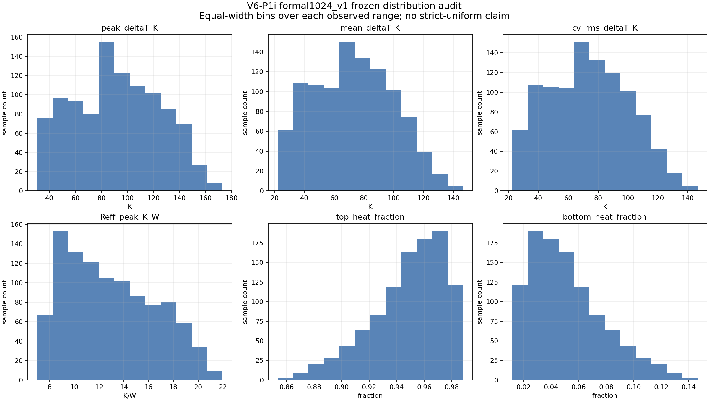
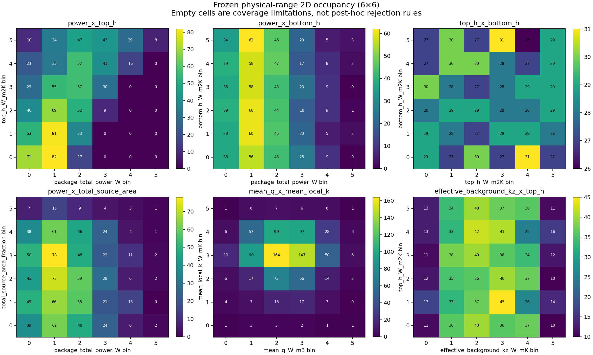
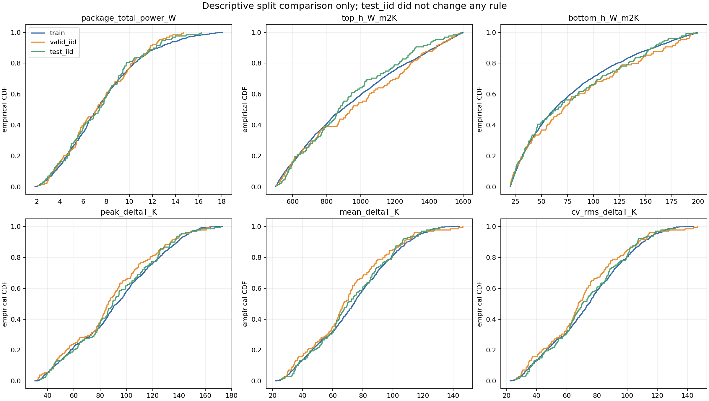

# V6-P1i formal1024_v1 训练前审计

## 结论

本轮对冻结的 `heat3d_v6_p1i_continuous_physics1024_v1` 执行零修改审计：没有重新生成、筛选或替换
样本，没有训练，也没有模型推理。审计支持 **continuous broad coverage
（连续宽覆盖）**；它不支持、本文也不宣称严格 uniform（均匀）。

训练授权判定为
`authorized_for_training_with_frozen_applicability_boundaries`。该授权只适用于冻结的耦合输入分布，并带有
两个重要边界：power–top_h 人为耦合，以及所有界面固定
`R_contact=0`。

## 一维物理响应分布

12-bin 为各指标冻结观测范围内的等宽分箱。KS/Wasserstein 以该观测范围
上的连续均匀分布为诊断参照，不是 uniform 验收门槛。

| 指标 | min–max | median | 占用bin | entropy | bin CV | KS | W1/range | max gap/range | KDE |
| --- | ---: | ---: | ---: | ---: | ---: | ---: | ---: | ---: | --- |
| peak_deltaT_K | 30.374–173.098 | 90.7767 | 12 | 0.951464 | 0.441294 | 0.154805 | 0.0711096 | 0.0285634 | bimodal |
| mean_deltaT_K | 22.0084–146.527 | 72.6429 | 12 | 0.931088 | 0.519458 | 0.205862 | 0.0950392 | 0.0431555 | unimodal |
| cv_rms_deltaT_K | 22.4866–146.717 | 73.0493 | 12 | 0.933712 | 0.509088 | 0.200215 | 0.093114 | 0.0434521 | unimodal |
| Reff_peak_K_W | 6.99222–21.9633 | 12.3489 | 12 | 0.950243 | 0.45809 | 0.171375 | 0.107737 | 0.0330804 | unimodal |
| top_heat_fraction | 0.853464–0.988291 | 0.953156 | 12 | 0.869146 | 0.761934 | 0.344699 | 0.202511 | 0.0555866 | unimodal |
| bottom_heat_fraction | 0.0117094–0.146536 | 0.0468435 | 12 | 0.869146 | 0.761934 | 0.344699 | 0.202511 | 0.0555866 | unimodal |

判定依据：peak、mean、CV-RMS ΔT 与 Reff 均占满 12 个 bin，归一化 entropy
均不低于 0.90，最大排序间隙不超过观测范围的 5%。分箱计数并不相等，
KS 也明确拒绝把多数指标当作严格均匀样本；因此只能称连续宽覆盖。
peak 的 Scott-bandwidth KDE 在 0.75×/1.0× 下呈两峰、在 1.25× 下并峰，
属于 bandwidth-sensitive shoulder，不能据此宣称稳定双峰；CV-RMS 在
0.75× 下也出现同类弱肩峰。

## 联合输入覆盖

物理 occupancy 使用 formal config 的冻结范围和 sampling-native
linear/log10 变换；derived 量使用冻结观测范围。另有 marginal-rank
occupancy，用于区分边缘分布偏斜与真正的联合依赖。

| pair | Pearson | Spearman | 占用cell | 空cell | high-x/low-y | NN P95 |
| --- | ---: | ---: | ---: | ---: | ---: | ---: |
| power_x_top_h | 0.561068 | 0.533374 | 25/36 | 11 | 0 | 0.0237052 |
| power_x_bottom_h | -7.27118e-05 | -9.03123e-05 | 34/36 | 2 | 1 | 0.0311625 |
| top_h_x_bottom_h | -0.000145966 | 0.000183106 | 36/36 | 0 | 42 | 0.0257237 |
| power_x_total_source_area | -0.00254387 | 0.00165734 | 35/36 | 1 | 3 | 0.0295102 |
| mean_q_x_mean_local_k | -0.0229303 | -0.0202511 | 35/36 | 1 | 2 | 0.0302884 |
| effective_background_kz_x_top_h | 1.21941e-05 | 0.000148494 | 36/36 | 0 | 21 | 0.0316794 |
| effective_background_kz_x_bottom_h | 0.000327145 | 2.69674e-05 | 36/36 | 0 | 23 | 0.032092 |

`power_x_top_h` 的 Spearman 为
`0.533374`，物理 6×6
网格有 `11` 个空 cell，
其中 high-power/low-top_h 角点为
`0` 个样本。这不是随机
缺口，而是冻结 power 规则包含 top_h exponent
`0.739654`
的直接结果。P1i-v1 因而不是 power 与 top_h 完全解混的数据集。

## Split 描述性审计

train/valid_iid/test_iid 数量为 `768/128/128`。本节只描述输入及
peak/mean/CV-RMS/Reff/heat-fraction 分布；test_iid 没有用于修改规则、
split、门槛或训练授权。train 对两个 holdout 的最大单变量 KS 为
`0.127604`，最大 range-normalized Wasserstein 为
`0.038394`。完整逐变量结果见 CSV。

## Perfect-contact 适用边界

P1h、P1i 和 V6 random-block 均采用 perfect interface contact，
`R_contact=0 m²K/W`。因此这些数据无法学习有限接触热阻变化，也不能把
其模型表现解释为对 contact-resistance OOD 的泛化证据。后续数据只能在
新的预注册版本中引入连续 `R_contact`：按真实相邻材料界面绑定，采用
log-space 连续抽样并保留显式零接触层；本轮不实现该方案。

## 文献 ID 与冻结绑定

新 registry 使用 `V6-LIT-NNN` 标识唯一 DOI/URL；所有 `P1I-Lxx` 与
`P1I3-Lxx` 通过 crosswalk 解析。background-k contract、formal config
和 formal manifest 都以 SHA256 固定，不回写冻结文件。

- formal config SHA256:
  `1e15a77fe51eea7ec64614566bb6bb12bfcf05948f3b7c8c6f3c85ec759a58f8`
- formal manifest SHA256:
  `f19987c659968c2ac14eade1f1ef7e206c8f7eeb94f58fde5897d6e765978514`
- manifest payload SHA256:
  `27d2ea3b7ec4e4ce9c6d068471cd19036ac8148b6cd57da325219d718c7e5ed5`
- background-k contract SHA256:
  `a0f504ceea7aa9b0a7ac1eea70a7be31a849a561e114d2fe8e5859c8cadbf703`

## 治理约束

- formal1024_v1 内容和 split 均未修改；
- 不使用 test 作规则调整；
- 不宣称 strict uniform；
- 不将 training authorization 扩展为 OOD、contact-resistance 或独立
  power–BC 覆盖保证；
- clean-checkout replay 和外部归档状态由独立 manifest 绑定。
